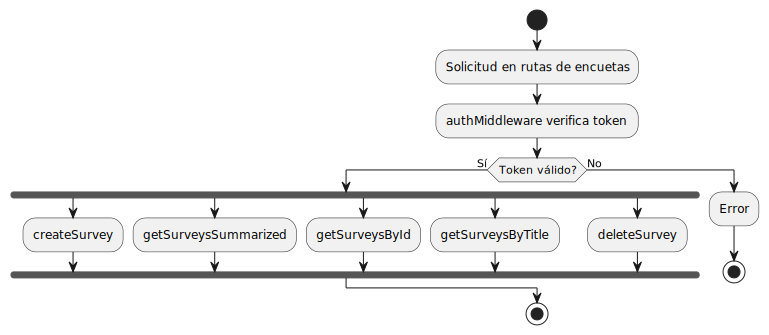

# Backend
## **controllers/**
### **authController.js**
Gestiona las operaciones relacionadas con la autenticación y el manejo de usuarios en el sistema. Proporciona las siguientes funcionalidades:

- **Registro de usuarios:** Permite crear un nuevo usuario en la base de datos y devuelve un token de autenticación.
- **Inicio de sesión:** Valida las credenciales y genera un token para acceder a recursos protegidos.
- **Eliminación de usuarios:** Borra un usuario de la base de datos utilizando su ID.
- **Actualización de usuarios:** Modifica los datos del usuario y encripta la nueva contraseña.
-**Búsqueda de usuarios:** Permite obtener información de un usuario por ID o correo electrónico.

Además, utiliza bibliotecas como **jsonwebtoken** (**JWT**) para manejar la autenticación basada en tokens y bcrypt para la encriptación de contraseñas. Esto asegura un manejo seguro y eficiente de la información de los usuarios. Como podemos observar, el token incluye en su payload información clave, como el ID del usuario, su nombre y su correo electrónico.

```javascript
exports.login = async (req, res) => {
    const { email, password } = req.body;

    try{

        ...
        
        const payload = {userId: user.id, name: user.name, email: user.email};
        const token = jwt.sign(payload, process.env.JWT_SECRET, {
            expiresIn: '1h'
        });

        res.json({token});
    }catch (error) {
        console.error(error);
        res.status(500).json({msg: 'Hubo un error'});
    }

}
```

### **surveyController.js**

Gestiona las operaciones relacionadas con las encuestas. Proporciona las siguientes funcionalidades:

- **Crear encuesta:** Permite a un usuario autenticado crear una nueva encuesta con un título, descripción y preguntas. La encuesta queda asociada al usuario que la creó.
- **Obtener encuestas:**
    - **Resumen:** Devuelve una lista de encuestas mostrando solo los campos de título y descripción.
    - **Por ID:** Devuelve una encuesta completa buscando por su ID único.
    - **Por título:** Busca encuestas cuyo título coincida parcial o completamente, utilizando expresiones regulares para una búsqueda flexible.
- **Eliminar encuesta:** Permite eliminar una encuesta específica identificada por su ID. El controlador utiliza el modelo Survey para interactuar con la base de datos y responde con datos o mensajes de error según sea necesario. Esto permite un manejo estructurado y seguro de las encuestas en el sistema.

## **Middleware/**
### **authMiddleware.js**

Este archivo proporciona dos funcionalidades relacionadas con la autenticación basada en tokens JWT:

`protect` (Middleware de protección):

- Se utiliza para proteger rutas que requieren que el usuario esté autenticado.
- Verifica la existencia de un token en el encabezado de la solicitud (`x-auth-token`).
- Decodifica el token usando la clave secreta definida en `process.env.JWT_SECRET` y agrega los datos decodificados al objeto `req.user`.
- Si el token no es válido o falta, responde con un error 401.
- Si el token es válido, permite continuar al siguiente middleware o controlador.

`verifyToken`:

- Verifica la validez de un token enviado en el encabezado `x-auth-token`.
- Responde con `true` si el token es válido y `false` si no lo es.
- Es útil para implementar funcionalidades como verificar sesiones activas en el cliente sin proteger rutas específicas.

Ambas funciones aseguran que las operaciones sensibles del sistema estén protegidas mediante la autenticación basada en tokens. Esto ayuda a evitar accesos no autorizados y garantiza que solo usuarios válidos interactúen con ciertas partes del sistema.

## **Models/**
### **Survey.js**
Estructura del esquema:

- **`title`:** Campo obligatorio y único que identifica la encuesta.
- **`description`:** Texto opcional que describe la encuesta.
- **`questions`:** Array que contiene preguntas de la encuesta. Cada pregunta incluye:
    - **`tipo`:** El tipo de pregunta, que puede ser texto libre (`text`), opción múltiple (`opcionM`) o sí/no (`siNo`).
    - **`pregunta`:** El texto de la pregunta (obligatorio).
    - **`opciones`:** Array opcional para las posibles respuestas (solo aplicable si tipo es opcionM).
    - **`user`:** Referencia al usuario que creó la encuesta, vinculando la encuesta con el modelo User.

### **User.js**
Estructura del esquema:

- **`name`:** Campo obligatorio que almacena el nombre del usuario.
- **`email`:** Campo obligatorio y único que almacena el correo electrónico del usuario.
- **`password`:** Campo obligatorio que almacena la contraseña del usuario (encriptada antes de guardarla en la base de datos).

## **Routes/**
### **auth.js**
Este archivo define las rutas para la gestión de usuarios y la autenticación en la aplicación. Cada ruta está asociada con un controlador o middleware que maneja la lógica correspondiente.

- Rutas públicas:
    - `/register`: Permite a un nuevo usuario registrarse. La lógica de registro está en el controlador register.
    - `/login`: Permite a un usuario autenticarse y recibir un token JWT. La lógica está en el controlador login.

- Rutas protegidas:

    Utilizan el middleware protect para garantizar que solo usuarios autenticados puedan acceder.
    - `/delete`: Permite al usuario autenticado eliminar su cuenta.
    - `/update`: Permite al usuario autenticado actualizar sus datos personales.
    - `/user/:id`: Recupera los datos de un usuario por su ID.
    - `/user/search/email`: Busca un usuario por su email. 

- Rutas específicas:
    - `/verify-Token`: Verifica si el token enviado por el cliente es válido. Es útil para comprobar sesiones activas.

### **survey.js**

Este archivo define las rutas relacionadas con la gestión de encuestas. Todas las rutas están protegidas mediante el middleware protect, lo que garantiza que solo los usuarios autenticados puedan acceder a ellas.

- Rutas definidas:

    - `/create`: Permite a un usuario autenticado crear una nueva encuesta. Utiliza el controlador createSurvey.
    - `/`: Recupera un resumen de todas las encuestas disponibles (títulos y descripciones) mediante el controlador getSurveysSummarized.
    - `/:id`: Obtiene una encuesta específica identificada por su ID a través del controlador getSurveysById.
    - `/search/by-title`: Busca encuestas que coincidan con un título parcial o completo usando el controlador getSurveysByTitle.
    - `/delete/:id`: Elimina una encuesta específica por su ID mediante el controlador deleteSurvey.
    ---



## config/
### **db.js**
Conexión con MongoDB:

- La función `connectDB` se define como asincrónica (`async`), lo que permite manejar la conexión a la base de datos de forma eficiente usando `await`.
- Se utiliza `mongoose.connect()` para establecer la conexión con MongoDB, pasando como parámetros la URI de la base de datos (`process.env.MONGO_URI`) y las opciones de configuración (`useNewUrlParser` y `useUnifiedTopology`).
    - `useNewUrlParser`: Configura el analizador de URL de MongoDB para que sea el más reciente.
    - `useUnifiedTopology`: Habilita el motor unificado de topología de MongoDB para manejar las conexiones de manera más robusta.

## **server.js**
Este archivo es el punto de entrada de la aplicación Express. Define la configuración básica del servidor, conecta la base de datos, maneja las rutas, y configura los middlewares necesarios para que la API funcione correctamente.

- **Configuración del servidor**:

    - Se utiliza Express para gestionar las rutas HTTP.
    - Se carga la configuración de las variables de entorno desde un archivo `.env` usando `dotenv.config()`.
    - El servidor se escucha en un puerto configurado en las variables de entorno, accesible a través de `process.env.PORT`.

- **Middlewares**:

    - **CORS (Cross-Origin Resource Sharing)**: Se habilita con app.use(cors()), lo que permite que la API sea accesible desde diferentes orígenes, útil si el frontend se encuentra en un dominio diferente.
    - **Body-Parser**: Configurado con `app.use(bodyParser.json())`, este middleware permite parsear las solicitudes JSON, lo cual es necesario para recibir y procesar datos en el cuerpo de las solicitudes HTTP.

- **Rutas**:

    - Se definen dos grupos de rutas principales:
        - `/api/auth`: Rutas relacionadas con la autenticación de usuarios (registro, inicio de sesión, etc.).
        - `/api/survey`: Rutas para manejar las encuestas (crear, buscar, eliminar encuestas, etc.).
    - Ambas rutas se manejan mediante los routers definidos en archivos separados (`authRoutes` y `surveyRoutes`), lo que mantiene el código modular y organizado.

- **Conexión a la base de datos**:

    Se llama a `connectDB()` en el arranque del servidor para conectar la aplicación con la base de datos.

- **Ruta raíz**:

    La ruta raíz (`/`) está configurada para devolver el mensaje 'API running', indicando que el servidor está en funcionamiento.

- **Inicio del servidor**:

    - Finalmente, el servidor Express escucha en el puerto especificado y muestra un mensaje en consola que confirma que está corriendo, además de establecer la conexión con la base de datos.

