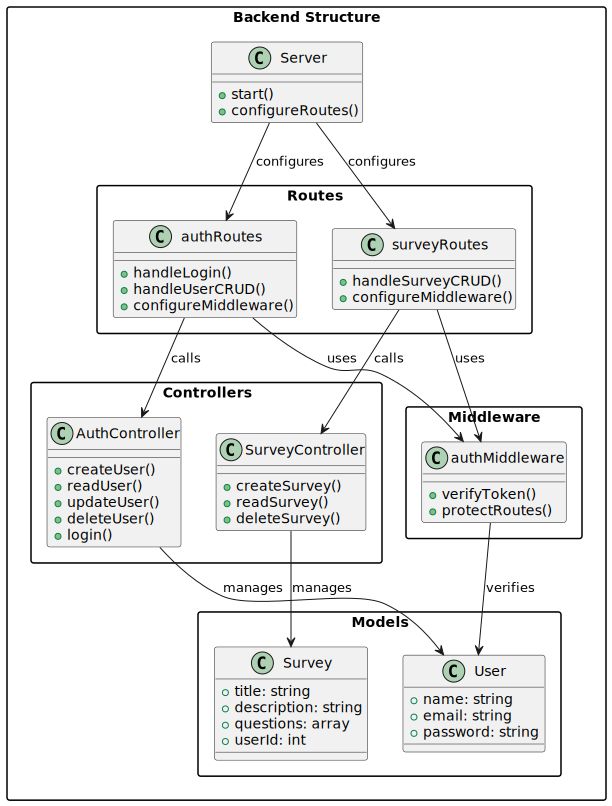

# Modelos del Dominio
## Backend:

| Imagen                                     |                                 |
| ------------------------------------------ | -------------------------------------- |
|  | [Enlace a la carpeta](backendDiagram.plantuml) |

## Frontend:
| Imagen                                     |                                 |
| ------------------------------------------ | -------------------------------------- |
|  | [Enlace a la carpeta](frontendDiagram.plantuml) |

# Casos de Uso
| Imagen                                     |                                 |
| ------------------------------------------ | -------------------------------------- |
|  | [Enlace a la carpeta](UserManagementUCs.plantuml) |
|  | [Enlace a la carpeta](SurveyManagementUcs.plantuml) |