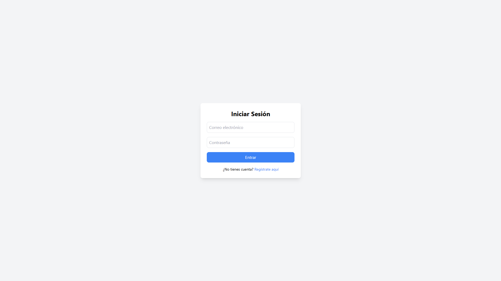
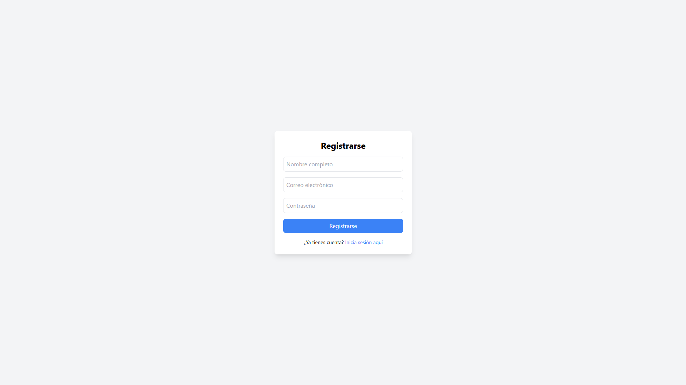
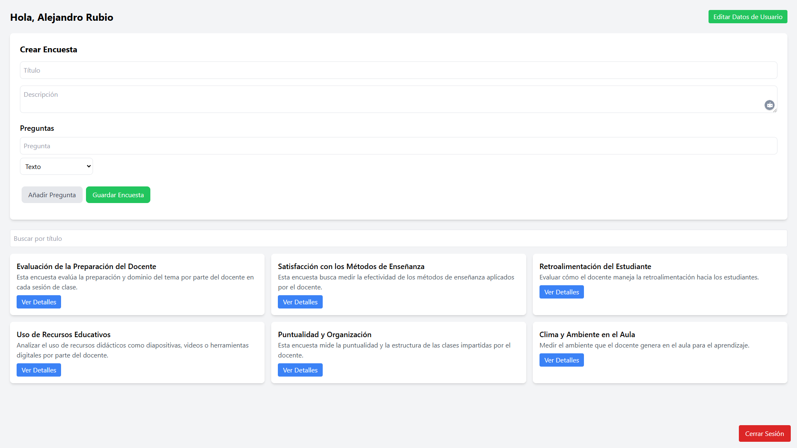
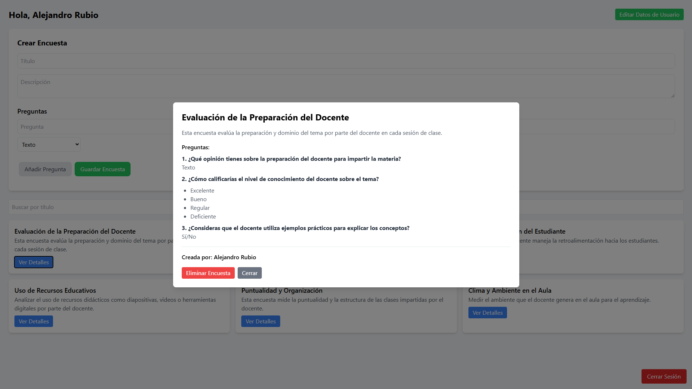
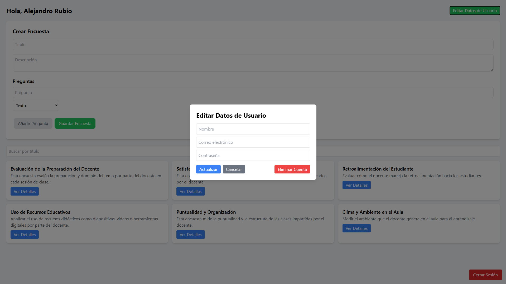

# Frontend
## **public/**
### **index.html**

Este archivo es la estructura base de la aplicación web, escrita en HTML. Define el esqueleto del documento donde React montará su interfaz. El elemento más importante es el `<div id="root">`, que actúa como el punto de entrada donde se renderizan los componentes React. Además, incluye configuraciones básicas como el favicon, metaetiquetas para el diseño responsivo y el título de la página.

## **src/**
## **components/**
### **AuthForm.jsx**
Propósito de este componente es el manejo de la lógica y la interfaz para el registro e inicio de sesión de usuarios.

Características:

- **Alternancia de modos:**

    - Permite al usuario cambiar entre **"Registrarse"** e **"Iniciar sesión"**.

- **Manejo de datos:**

    - Los datos del formulario se actualizan dinámicamente mediante `handleChange`.

- **Llamadas API:**

    - En el modo registro, realiza una solicitud **POST** al endpoint `/auth/register`.
    - En el modo inicio de sesión, envía una solicitud **POST** a `/auth/login` y obtiene información adicional del usuario.

### **SurveyForm,jsx**

1. **Estructura del formulario**

    El formulario permite a los usuarios crear encuestas dinámicas mediante una interfaz intuitiva. Se divide en secciones principales:

    - **Título y descripción de la encuesta:** Estos campos son obligatorios y sirven para identificar la encuesta y proporcionar un contexto general.
    - **Preguntas:** Se pueden añadir múltiples preguntas, cada una con un tipo definido (**texto, opción múltiple, o sí/no**) y, en el caso de las preguntas de opción múltiple, con opciones asociadas.

2. **Gestión del estado**
    El estado del formulario se gestiona mediante `useState`, con dos estados principales:

    - `formData`: Contiene los datos ingresados por el usuario, como el título, descripción y las preguntas.
    - `error`: Almacena mensajes de error para informar al usuario sobre problemas de validación, como campos incompletos o preguntas mal configuradas.

3. **Validación dinámica**

    Antes de añadir preguntas o enviar el formulario, el componente verifica:

    - Que el título de la encuesta no esté vacío.
    - Que todas las preguntas tengan un texto válido.
    - Que las preguntas de tipo "opción múltiple" incluyan al menos una opción.

    Esto asegura que los datos enviados al backend cumplan con los requisitos mínimos.

4. **Manejo de eventos**

    El formulario incluye varias funciones para manejar interacciones del usuario:

    - `handleChange`: Actualiza los campos generales como el título y la descripción.
    - `handleQuestionChange`: Modifica los datos de preguntas específicas, como el texto o el tipo.
    - `handleOptionChange`: Permite agregar y editar opciones de preguntas de tipo "opción múltiple".
    - `addQuestion`: Añade una nueva pregunta al formulario, validando que la última pregunta agregada esté correctamente configurada.

        ```javascript
        const addQuestion = () => {
        const currentQuestion = formData.questions[formData.questions.length - 1];
        if (!currentQuestion.pregunta) {
            setError('La pregunta es obligatoria.');
            return;
        }
        if (currentQuestion.tipo === 'opcionM' && currentQuestion.opciones.length === 0) {
            setError('Las preguntas de opción múltiple requieren al menos una opción.');
            return;
        }

        setFormData({
        ...formData,
        questions: [...formData.questions, { tipo: 'text', pregunta: '', opciones: [] }],
        });
            setError('');
        };
        ```
    - `addOption`: Añade una nueva opción vacía a una pregunta específica.

5. **Envío del formulario**

    Al enviar el formulario, se realizan las siguientes acciones:

    - Se valida que los datos mínimos estén completos.
    - Se realiza una solicitud **POST** al endpoint `/survey/create`, enviando los datos de la encuesta al backend.
    - Si la solicitud es exitosa, se restablece el formulario a su estado inicial y se notifica al componente padre mediante la función `onEncuestaCreada`.

## **pages/**
### **AuthPage.jsx**
**AuthPage** actúa como el puente entre la autenticación y la navegación. Su propósito es coordinar el flujo de trabajo después de que el usuario completa el proceso de autenticación, asegurándose de que sea dirigido al lugar correcto en la aplicación.

**Lógica principal**
1. **Navegación con `useNavigate`**:

    - `useNavigate` es un hook de **react-router-dom** que permite programar redirecciones dentro de la aplicación.
    - En este caso, lo utilizamos para enviar al usuario a la página `/encuestas` tras una autenticación exitosa.

2. **Función `handleAuthSuccess`**:

    - Esta función se pasa como una prop (`onAuthSuccess`) al componente `AuthForm`.
    - Cuando el formulario de autenticación finaliza correctamente (por ejemplo, el usuario inicia sesión o se registra), `AuthForm` llama a esta función para notificar que el proceso se completó.
    - Dentro de la función, usamos `navigate('/encuestas')` para redirigir al usuario a la ruta `/encuestas`.

3. Renderización del formulario:

    - `AuthForm` es un componente reutilizable que gestiona los estados del formulario, la validación y la comunicación con el backend.
    - La lógica de autenticación (registro/inicio de sesión) está encapsulada dentro de este componente, mientras que `AuthPage` se encarga solo de manejar el flujo de redirección.

### **SurveyPage.jsx**
SurveyPage gestiona las encuestas, la información del usuario y la interacción con el sistema, asegurándose de que los usuarios puedan crear, ver, buscar y eliminar encuestas.

1. **Llamadas a la API:**
    - `fetchSurveys`: Realiza una llamada a la API para obtener todas las encuestas(`/survey`) o filtrar por título si se proporciona un término de búsqueda (`/survey/search/by-title?title=${title}`).
    - `viewSurveyDetails`: Obtiene los detalles de una encuesta específica (`/survey/${id}`), incluyendo información sobre el creador de la encuesta (`auth/user/${data.user}`), y los muestra en un modal.
    - `deleteSurvey`: Elimina una encuesta específica usando la siguiente ruta: `/survey/delete/${id}`, y actualiza la lista de encuestas .
    - `updateUser`: Actualiza los datos del usuario en el servidor con la información del formulario (`/auth/update, userData`).
    - `deleteUser`: Elimina la cuenta del usuario (`/auth/delete`) y lo redirige a la página principal con `navigate('/')`.

2. **Seguridad y Gestión de Sesión:**

    - **Verificación del Token:** En el `useEffect`, la función `verifyToken` la cual realiza una llamada a la API en: `/auth/verify-Token` y se asegura de que el token de autenticación sea válido. Si no lo es, el usuario es redirigido a la página principal.
    - **Cerrar Sesión (`logout`):** Elimina el token del `localStorage` y redirige al usuario a la página principal.

3. **Efectos (useEffect):**

    - **Verificación del Token:** Al cargar el componente, se verifica si el token de autenticación es válido. Si no lo es, el usuario es redirigido a la página principal.
    - **Carga Inicial de Encuestas:** Al cargar la página, las encuestas se obtienen desde la API y se almacena el nombre del usuario en el estado `username`.
    - **Búsqueda Dinámica:** Cada vez que el usuario cambia el término de búsqueda, se actualiza la lista de encuestas de acuerdo con el término ingresado.

## **Services/**
### **api.js**
1. **Configuración Inicial:** 
    - Se define la URL base de la API usando una variable de entorno (`API_URL`).
2. **Interceptor de Solicitud:**
    - Se verifica si hay un token en el `localStorage`.
    - Si existe, se agrega al encabezado `x-auth-token` de la solicitud.
    - Si ocurre un error, se rechaza la solicitud.
## **App.js**
Dentro del componente Routes, se definen dos rutas:

- La primera ruta es `"/"`, que corresponde a la página de inicio de sesión (`LoginPage`). Esto significa que cuando el usuario accede a la URL raíz de la aplicación (por ejemplo, http://localhost:3000/), se mostrará el componente `LoginPage`.
- La segunda ruta es `"/encuestas"`, que corresponde a la página de encuestas (`SurveyPage`). Esta ruta se activa cuando el usuario navega a http://localhost:3000/encuestas, y renderiza el componente `SurveyPage`.

## **index.js**
Este archivo es esencialmente el punto de inicio de la aplicación React. Aquí se importa el componente `App`, se envuelve en `React.StrictMode` para facilitar el desarrollo y se renderiza en el DOM dentro del elemento con el id `root`. Esto le indica a React dónde debe comenzar la renderización de la interfaz de usuario.

## Interfaz grafica

## Login

## Register

## Encuestas

### Modal de "Ver Detalles"

### Modal de "Editar Datos del Usuario"


